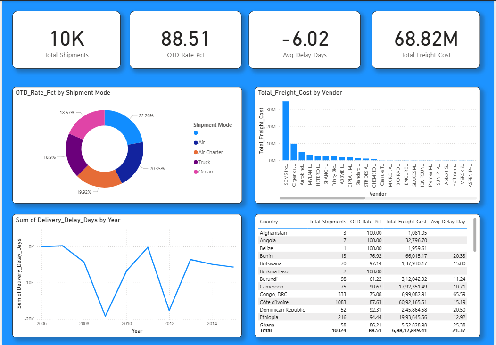

# 📦 Supply Chain Logistics Dashboard

Welcome to my supply chain analytics project! This repository contains an end-to-end data analysis workflow—taking raw delivery data, cleaning it with Python, and turning it into a professional, interactive Power BI dashboard.

---

## 🚀 What This Project Does
* **Data Cleaning (Python):** Handles missing values, fixes data formats, and prepares raw shipping logs for analysis.
* **Data Visualization (Power BI):** Displays key metrics like total shipments, on-time delivery (OTD) rates, freight costs, and shipping delays in a clean, executive-ready dashboard.

---

## 📷 Dashboard Preview


---

## 📂 Project Structure
```text
SupplyChainLogistics-Dashboard/
│
├── data/                  # Contains raw and cleaned CSV datasets
├── dashboard/             # Stores the Power BI dashboard screenshot
├── notebook/              # Jupyter Notebook used for data cleaning
└── README.md              # Project documentation

🛠️ Tech Stack
Python (Pandas, Jupyter Notebook)

Power BI (DAX measures, visual layouts)

Git & GitHub (Version control)

💡 Key Insights
Overall OTD Rate: Maintaining an on-time delivery rate of 88.51%.

Total Shipments: Over 10,000 shipments tracked globally.

Freight Costs: Over $68.82 Million analyzed across various vendors and transportation modes.